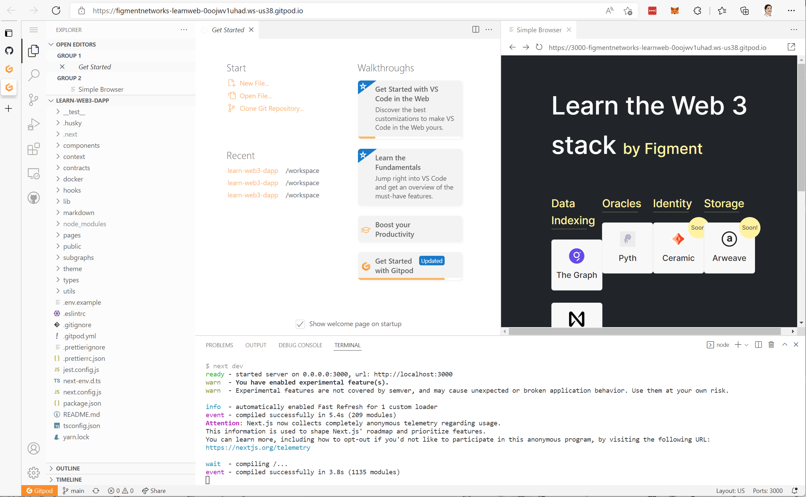

# Lab Setup

1. Navigate to the labs URL:

    <https://gitpod.io/#https://github.com/figment-networks/learn-web3-dapp>

    

2. Select **Continue with GitHub**.

3. Login with your GitHub credentials.

4. If prompted, select **Authorize gitpod-io**

> NOTE If you don't have a GitHub Account, follow the instructions in the section below to **Create a GitHub Account**.

## Create a GitHub Account

1. If you don't have a GitHub account yet, create one by selecting **Create Account**.

    

    

    

    

    

2. After confirming your email, return to the Lab URL.

## Preparing your GitPod Environment

1. Navigate to the Lab URL

    <https://gitpod.io/#https://github.com/figment-networks/learn-web3-dapp>

2. When Gitpod first loads, it will appear something like this:

    

3. This layout can be a little restrictive on a small screen, so begin by adjusting the layout to give the Sample Browser some more real-estate.

4. Drag the tab labeled Sample Browser to the left and drop it over the tab labeled **Get Started**. Now you should be able to see the browser content better (as shown in the figure). It's important because this is the view that you will use to interact with your code changes.

    
