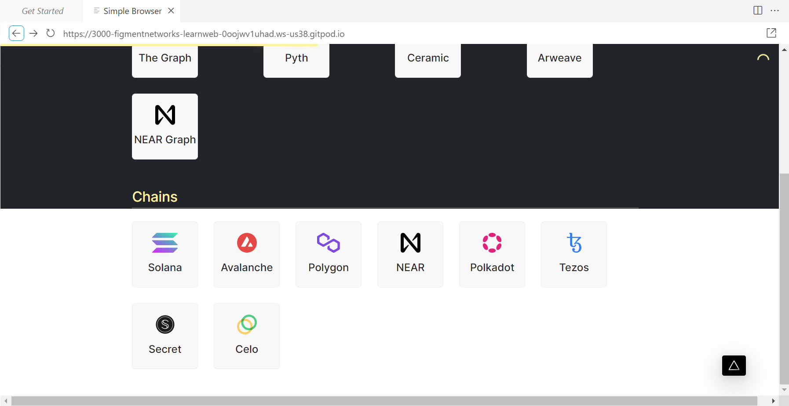

# Polkadot Lab

Duration: ~2 hours

This lab will take you thru a server-side approach to working with the Polkadot blockchain.

In this lab you will:

🔌 Connect to Polkadot using a Javascript library

🏦 Create and fund an account with testnet tokens

🌱 Restore an account with a mnemonic seed phrase

🤔 Estimate transaction fees and view an account balance

😅 Understand the \"existential deposit\" which keeps accounts remaining
open

💸 Transfer tokens between accounts

1. With your Gitpod ready to use, within the **Simple Browser** tab, scroll down until you see the Chains listing.

2. Select **Polkadot**.

    

## Welcome to the Polkadot Pathway

1. Read the overview instructions that appear for the Pathway. This first step does not require you to make any code changes, it's just an overview of the approach so you know what to expect.

2. When you've finished reading the overview, look for a large navigation button labeled **Setup the Project** near the bottom right of the Sample Browser panel and select that.

    

## Setup the project

1. Right click the **Signup for a DataHub account** link and select to open that in new tab in your browser.

    

2. Switch to that tab and complete the registration for the free DataHub account and select **Sign Up**.

    

3. Confirm your e-mail address.

    

    

4. Login to Datahub with the credentials you created

    

5. Return to the Gitpod environment and follow the instructions for acquiring a DataHub key and adding to your code. Remeber we are building a Polkadot app.

    - Create New App
    - Type an **App name**
    - For environment, type **Staging**
    - Select **Polkadot**
    - Select **Create app**
    - Select **View key**
    - Copy the key

6. When you have copied the key, you will to create a .env file in which to store it. Follow these steps:

   1. Switch back to the gitpod.

   2. From the left treeview of the Gitpod environment under the root folder /learn-web3-dapp locate the `.env.example` file.

   3. Right click the file and select **Rename**. Change the name to just `.env`

   4. Double click the .env file to open it in a new editor panel.

    

7. Paste your key as the value for the `DATAHUB_POLKADOT_API_KEY` and close the `.env` tab.

    > NOTE: Whenever the instructions tell you edit code, look for the code file in the Explorer tree view just as you did for the `.env.example` file.

8. Select the navigation button **Connect to Polkadot** to continue.

## Connect to Polkadot

1. In the **Connect to Polkadot** window, follow the instructions to edit your copy of connect.ts (remember you can find this file using the Explorer in the Gitpod interface, under
`/pages/api/Polkadot`).

2. When you have completed the code, select the **Connect to Polkadot** button. If all went well you should see a shower of confetti and the Polkadot version.

    

3. Select the navigation button **Create an Account** to continue.

## Create an Account

1. Follow the instruction to complete the `account.ts` file to create a mnemonic, add it to your key ring and then derive an account from that mnemonic to get your wallet address.

2. When you have successfully completed the code, you should see something like:

    

3. Copy the address of your wallet by clicking on the copy button. Then right click **Go to the faucet** to open the Polkadot faucet in a new window.

4. When prompted, select **Sign up** to register for the chat room.

    

5. You should select to login with your GitHub credentials.

    

6. Select **Authorize matrix.org**

    

7. Create your username for the chat.

    

8. Select **Continue** twice to complete the registration.

9. Return to the faucet page, which is:

    [https://app.element.io/#/room/#westend_faucet:matrix.org](https://app.element.io/#/room/)

10. Select **Join the Discussion**

    

11. Enter `!drip` followed by your wallet address to request the drip and wait for the confirmation like so:

    

12. Switch back to the gitpog window, select the navigation button labeled **Restore an account**.

## Restore an account

1. Follow the instructions to learn how to restore your account from the mnemonic. Select **Resource Account**, once so successful you should see your restored address as
follows:

    

2. Select the navigation button **Estimate  fees**.

## Estimate Transaction Fees

1. Follow the instructions. When complete you should see something like:

    

2. Select the navigation button **Get the balance** to continue.

## Get the Balance

1. Follow the instructions, then select **Check Balance**, when complete you should see something like:

    

2. Select the navigation button **Existential deposit** to continue.

## Existential Deposit

1. Follow the instructions, then select **Get Existentical Deposit**. When complete you should see something like:

    

2. Select the navigation button **Transfer some tokens** to continue.

## Transfer Some Tokens

1. Follow the instructions, then select **Submit Transfer**. When complete you should see something like:

    

2. Right-click and open the **View on Block Explorer** link in a new browser tab. Take moment to read the details of the transaction as it was captured in the blockchain. Take a look at the value and compare it against the fee. For
reference 1 plank is 0.000000000001 WND.

    

3. Switch back to **gitpod** and select the navigation button **Pathway complete** to continue.
