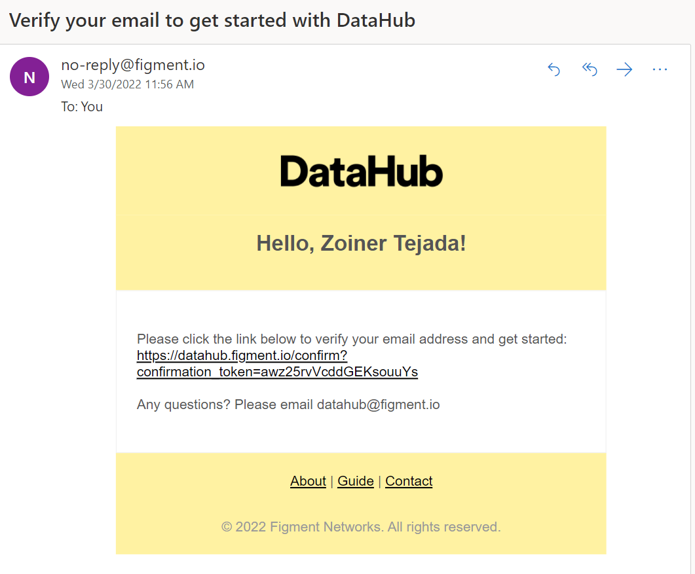
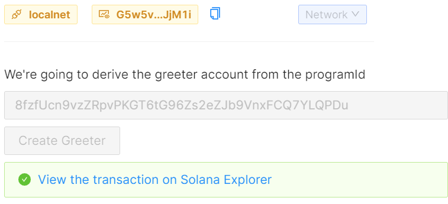

# Solana

Duration: ~2 hours

This lab will take you thru a client-side approach to working with the Solana blockchain.

In this lab you will:

- 🔌 Connect to a Solana cluster using the web3.js library

- 🏦 Generate a new keypair, then fund the resulting address with an airdrop

- 💸 Transfer tokens between accounts

- ⛓ Deploy and interact with a Solana program (aka Smart Contract), written in Rust

1. With your Gitpod ready to use, within the Sample Browser tab, scroll down until you see the Chains listing.

2. Select **Solana**.

    

## Welcome to the Solana Pathway

1. Read the overview instructions that appear for the Pathway. This first step does not require you to make any code changes, it's just an overview of the approach so you know what to expect.

2. When you've finished reading the overview, look for a large navigation button labeled **Setup the Project** near the bottom right of the Sample Browser panel and select that.

    

## Setup the project

1. The first thing you need to do in this step is to install the Solana CLI. To install the CLI into your GitPod instance, follow these steps:

   1. Near the bottom right of the Sample Browser panel, at the top of the terminal panel, select the **+** button and then select **bash** to create a new bash shell instance.

        

   2. Within the bash shell that appears, paste the following command to download and install the Solana CLI.

        ```bash
        sh -c "$(curl -sSfL https://release.solana.com/v1.10.6/install)"
        ```

        

   3. When it finishes you will see a note to close and reopen your terminal to apply the path changes.

2. Run the following command to add the Solana CLI path to your active terminal session:

    ```bash
    export PATH="/home/gitpod/.local/share/solana/install/active_release/bin:$PATH"
    ```

3. Close the bash terminal you just opened by hovering over the word bash on the far right of the terminal area and selecting the trash icon.

    

4. Load a new bash terminal instance by selecting the **+** button as you did before and selecting **bash**.

    

5. Confirm you have Solana installed by running:

    ```bash
    solana --version
    ```

6. You should see output similar to the following:

    

7. Next you will need to get you DataHub API keys. In this step, right click the **Signup for DataHub account** link and select to open that in new tab in your browser.

    

8. Switch to that tab and complete the registration for the free DataHub account.

    

9. Confirm your e-mail address.

    

    

10. Login to Datahub with the credentials you created

    

11. Return to the Gitpod environment and follow the instructions for acquiring a DataHub key and adding to your code.

12. Be sure to select Solana as the protocol when creating your app in DataHub!

13. When you have copied the key, you will need to create a `.env` file in which to store it. Follow these steps:

   1. From the left treeview of the Gitpod environment under the root folder /learn-web3-dapp locate the file .env.example.

   2. Right click the file and select Rename. Change the name to just `.env`

   3. Double click the `.env` file to open it in a new editor panel.

    

14. Paste your key as instructed and close the `.env` tab.

    > NOTE: Whenever the instructions tell you edit code, look for the code file in the Explorer tree view just as you did for the `.env` file.

15. Select the navigation button **Connect to Solana** to continue.

## Connect to Solana

1. Follow the instructions. Make sure to select Network-\>Devnet before selecting connect otherwise you will see an error.

2. When complete you should see something like:

    

3. Select the navigation button **Create an account** to continue.

## Create an account

1. Follow the instructions. When complete you should see something like:

    

2. Select the navigation button **Fund the account with SOL** to continue.

## Fund the account with SOL

1. Follow the instructions. When you select Fund this address you should see something like:

    

2. Open the **View on Solana Explorer** link in a new browser tab and take moment to read the details of the transaction as it was captured in the blockchain. Look at the fee that was charged. Also, examine the Transfer Amount (SOL) to see how much was moved.

    

3. Select the navigation button **Get the balance** to continue.

## Get the balance

1. Follow the instructions. When you select Fund this address you should see something like:

    

2. Select the navigation button **Transfer some SOL** to continue.

## Transfer some SOL

1. Follow the instructions to complete the code.

2. Provide the amount to transfer and select **Generate an address** to create a random address to transfer the test funds to.

    

3. Then select **Submit Transfer**, you should see something like:

    

4. Take a look at the transaction on the Solana Explorer.

5. Select the navigation button **Deploy a program** to continue.

## Deploy a program

1. Follow the instructions and execute the commands provided in your Gitpod terminal.

2. When you get to the Challenge, be sure you go back to the Connect to Solana step and change the Network to `localnet`. Then return to this
Deploy a program step to continue using the localnet as your network.

3. The output of your deployment includes the program ID you will need to paste into the text box before selecting Check Deployment.

    

4. Copy that value and paste it into the text box similar to the following:

    

5. Then proceed with completing the code. When you have done so and selected **Check Deployment**, you should see something similar to the following:

    

6. Select the navigation button **Create storage for the program** to continue.

## Create storage for the program

1. Follow the instructions, you should see something similar to the following when successful:

    

2. Select the navigation button **Get data from the program** to continue.

## Get data

1. Follow the instructions, you should see something like the following when successful:

    

2. Select the navigation button **Pathway Complete** to continue.
