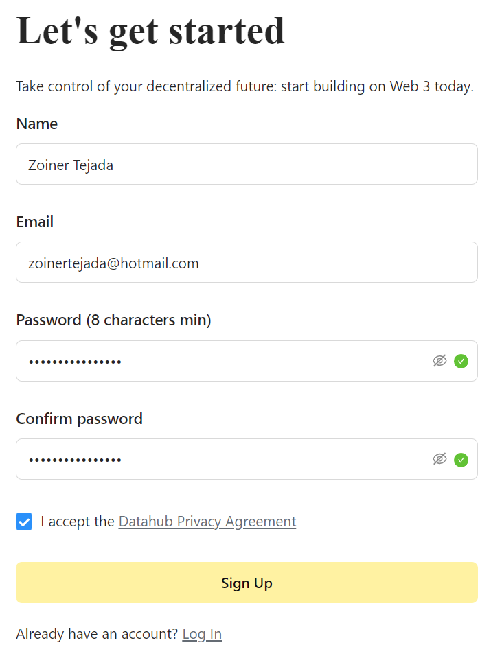
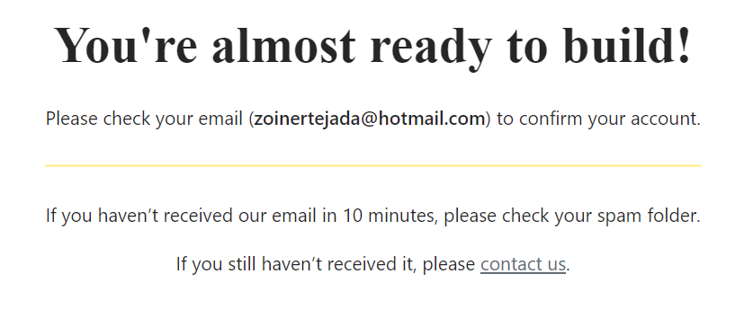
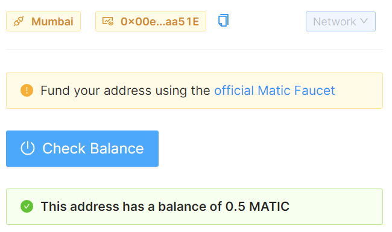

# Polygon

Duration: ~2 hours

This lab will take you thru a client-side approach to working with the Polygon blockchain.

In this lab you will:

- 🔌 Connect to Polygon with Metamask

- ⁉️ Query Polygon for specific information

- 🏦 Fund a Polygon testnet account with the faucet

- 💸 Transfer tokens between accounts

- ⛓ Deploy and interact with a Solidity smart contract

1. With your Gitpod ready to use, within the Sample Browser tab, scroll down until you see the **Chains** listing.

2. Select **Polygon**.

    

## Welcome to the Polygon Pathway

1. Read the overview instructions that appear for the Pathway. This first step does not require you to make any code changes, it's just an overview of the approach so you know what to expect.

2. When you've finished reading the overview, look for a large navigation button labeled **Setup the Project** near the bottom right of the Sample Browser panel and select that.

    

## Setup the project

1. The first thing you need to do is install the Metamask wallet on your computer if you do not already have it. Select the link provided.

    

2. On the Metamask site, select **Download Now**.

    

3. This should take to a page that detects your browser and prompts you to install the version appropriate to your browser. Select the **Install
Metamask for XYZ**

    

4. Switch back to the gitpod window.

5. Follow the instructions after your download.  Be sure that you add the **Mumbai testnet** to the Metamask wallet.

6. Next you will need to get your DataHub API keys. In this step, right click the **Signup for DataHub** link and select to open that in new tab in your browser.

    

7. Switch to that tab and complete the registration for the free DataHub account.

    

8. Confirm your e-mail address.

    

    

9. Login to Datahub with the credentials you created

    

10. Return to the Gitpod environment and follow the instructions for acquiring a DataHub key and adding to your code.

11. Be sure to select **Polygon** as the protocol when creating your app in DataHub!

12. When you have copied the key, you will need to create a `.env` file in which to store it. Follow these steps:

    1. From the left treeview of the Gitpod environment under the root folder /learn-web3-dapp locate the file `.env.example`.

    2. Right click the file and select **Rename**. Change the name to just `.env`

    3. Double click the `.env` file to open it in a new editor panel.

    

13. Paste your key as the value for the `DATAHUB_POLYGON_API_KEY` variable then close the `env` tab.

    > NOTE: Whenever the instructions tell you edit code, look for the code file in the Explorer tree view just as you did for the .env.example file.

14. Select the navigation button **Connect to Polygon** to continue.

    > NOTE: You may need to re-open your metamask wallet to provide the permission access.

## Connect to Polygon

1. Follow the instructions. When complete you should see something like:

    

2. Select the navigation button **Query Polygon** to continue.

## Query Polygon

1. Follow the instructions. When complete you should see something like:

    

2. Select the navigation button **Fund a Polygon account** to continue.

## Fund a Polygon account

1. Follow the instructions. When complete you should see something like:

    

2. Select the navigation button **Transfer some MATIC** to continue.

## Transfer some MATIC

1. Follow the instructions. You should be prompted with MetaMask to confirm the transfer. Select **Confirm** after making sure the source address your address.

    

2. When complete you should see something like:

    

3. Select the navigation button **Deploy a Solidity Smart Contract** to continue.

## Deploy a Solidity Smart Contract

1. Follow the instructions. When prompted to install truffle, you can use bash from within GitPod. To do so follow these steps:

   1. In the terminal area (bottom quarter of the GitPod UI), select the bash item (if you do not have the `bash` window, select **+->Bash**).

        

   2. Next copy and paste the following command to install truffle using npm:

        ```javascript
        npm install -g truffle
        ```

        

   3. Next run the following:

        ```javascript
        cd contracts/polygon/SimpleStorage
        ```

   4. Finally, run the following:

        ```javascript
        yarn
        ```

2. When prompted to open a separate terminal window to run the truffle development blockchain, follow these steps to split the current bash
window:

   1. Hover over bash near the right of the terminal window.

   2. Select the split window icon

        

   3. In the new bash terminal, run the following command:

        ```javascript
        truffle develop
        ```

3. When you get to the section titled **Deploy the smart contract**, you'll want to make one change to the truffle configuration before following the instructions to deploy the smart contract to the Mumbai test network. You need to specify the gas price you are willing to pay for the deployment. If you do not set this value, you will get a long error that near the top indicates "transaction underpriced". Follow these steps:

   1. Open the `/contracts/polygon/SimpleStorage/truffle-config.js` file

   2. Scroll down into you see the configuration area for `matic`, and between the `confirmation` and `timeoutBlocks` keys, add a new key for `gasPrice` that is set for `35` gwei. Your addition should look similar to the following:

        ```json
        matic: {
            provider: () =>
                new HDWalletProvider({
                privateKeys: [privateKey],
                providerOrUrl: `https://matic-mumbai.chainstacklabs.com`,
                chainId: 80001,
                }),
            network_id: 80001,
            confirmations: 2,
            gasPrice: 35,
            timeoutBlocks: 200,
            skipDryRun: true,
            chainId: 80001,
            }
        ```

4. When you have migrated your smart contract, which causes the deployment to the Mumbai test network, the output will provide the smart contract address.

5. Copy the contract address value

6. Paste it into the contact address textbox and select **Check deployment**. Success should look similar to the following:

    

    ```text
    Example address: 0x11ef085603162a59AB28CA66A59da6E9b8eC28Fb
    ```

7. Select the navigation button **Set the storage of the contract** to continue.

## Set the storage of the contract

1. Follow the instructions. After completing the code changes, provide a new value to store and select Set Value. You should see results similar
to the following:

    

2. Select the navigation button Get the storage of the contract to continue.

## Get the storage of the contract

1. Follow the instructions. After completing the code changes, select **Get Value**. You should see results similar to the following:

    

2. Select the navigation button **Restore your account** to continue.

## Restore your account

If you have reached this step in the lab, congratulations you have completed the pathway! You can optionally choose to restore your wallet
from the mnemonic, but only do this if you are using a test wallet not associated with any actual crypto assets.
